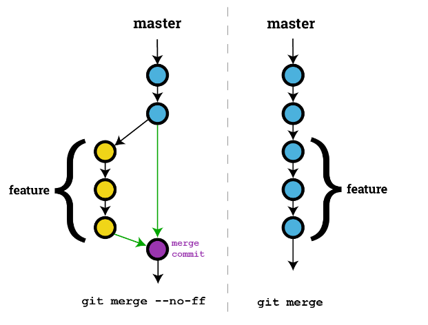
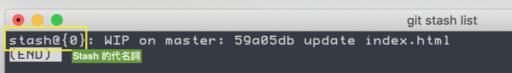
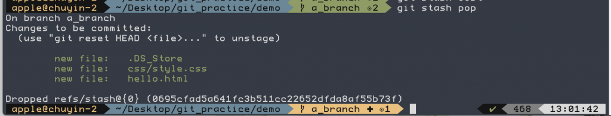
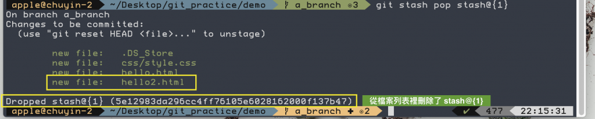
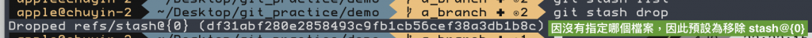

```Text
Author: Antony_Weng <weng851107@gmail.com>

This file is only used for the record of the learning process, only used by myself and the file has never been leaked out.
If there is related infringement or violation of related regulations, please contact me and the related files will be deleted immediately. Thank you!
```

# 目錄

- [Note](#0)
- [Git](#1)
  - [git branch](#1.1)
  - [git checkout](#1.2)
  - [git remote](#1.3)
  - [git rebase -i](#1.4)
  - [git merge & git rebase](#1.5)
  - [git stash](#1.6)
  - [git reset](#1.7)
  - [Pull Request](#1.8)
  - [.gitignore](#1.9)
  - [生成patch和應用patch](#1.10)
- [Git LFS](#2)
  - [.gitattributes](#2.1)
  - [指令](#2.2)
  - [原理](#2.3)


<h1 id="0">Note</h1>

[第一次學Git的筆記 - Notion](https://www.notion.so/Git-6918fdaf23cc401db6f7841ffba103f4)

<h1 id="1">Git</h1>

- `git add <change file or .>`

- `git commit -m "comments"`

- 使用 `git clone -b <branch name> <HTTP>` 下載某分支

- 使用 `git log` & `git log --oneline` 查看commit情況

- 使用 `git push -u <repository name> <branch name>` 把本機倉庫更新至遠程倉庫

- 使用 `git pull <repository name> <branch name>` 把遠程倉庫更新至本機倉庫

- 使用 `git pull --rebase <repository name> <branch name>` 可以把遠程倉庫(有不衝突的東西被多commit)，更新到本機倉庫且不會多一個merge的commit，且別人新commit的會在我的之前

- 使用 `git restore <file>` 來撤銷文件工作區的修改

- 使用 `git restore --staged <file>` 將文件從暫存區撤出，但不會撤銷文件的更改

<h2 id="1.1">git branch</h2>

- 使用 `git branch` 查看分支

- 使用 `git branch -a` 查看全部分支

- 使用 `git branch <new branch name>` 建立新的分支

- 刪除本地分支 `git branch -D <branch name>`

- 刪除遠程倉庫的分支 `git push <remote repository> --delete <remote branch name>`

<h2 id="1.2">git checkout</h2>

- 使用 `git checkout <branch name>` 切換分支

- 使用 `git checkout -b <new branch name>` 建立新的 branch 並且切換過去

<h2 id="1.3">git remote</h2>

- 使用 `git remote` 查看遠程倉庫

- 使用 `git remote add <new repository name> <HTTP>` 來新增遠程倉庫

- 使用 `git remote rm <repository name>`

<h2 id="1.4">git rebase -i</h2>

- 使用 `git rebase -i <SHA1>` 進入從現在到 `SHA1` 這個 Commit 的互動模式

   ```Git
   # p, pick = use commit
   # r, reword = use commit, but edit the commit message
   # e, edit = use commit, but stop for amending
   # s, squash = use commit, but meld into previous commit
   # f, fixup = like "squash", but discard this commit's log message
   # x, exec = run command (the rest of the line) using shell
   # d, drop = remove commit
   ```

- **交換commit順序** - 在Interactive Mode中調整要交換的commit，注意邏輯性

- **修改 commit message** - `reword`

- **合併 commits** - `squash` & `fixup`

- **修改 commit** - `edit`

   ```
   在這裡下 edit 指令來編輯 commit 內容

   -------------------------------------------------------
   # git rebase -i
   pick c3cff8a form to add more students
   pick 7e128b4 wrap the form with div
   pick 53616de add student id and age field into the form
   edit c5b9ad8 add gender select box
   -------------------------------------------------------

   存檔並關閉之後，現在的狀態是停在剛 commit 完 "add gender select box" 的時候，
   所以現在可以偷改你要改的東西，存檔以後把改的檔案用 git add 加進 staging area ，
   再打 `git rebase --continue` 來繼續，這時候因為 staging area 裡面有東西，
   git 會將它們與 "add gender select box" 透過 commit --amend 一起重新 commit 。
   ```

- **拆散 commit** - `edit`, `git reset HEAD^`

   ```
   在這裡下 edit 指令來編輯 commit 內容

   -------------------------------------------------------
   # git rebase -i
   pick c3cff8a form to add more students
   pick 7e128b4 wrap the form with div
   edit 53616de add student id and age field into the form
   pick 4dbcf49 add gender select box
   -------------------------------------------------------

   存檔並關閉之後，現在的狀態是停在剛 commit 完 "add student id and age field into the form" 的時候，接著
   使用 `git reset HEAD^` 來把目前的 HEAD 指標給指到 HEAD 的前一個，指完之後，原本 HEAD commit 的內容就被倒出來。
   現在我可以一個一個 commit，原本是 add student id and age field ，
   我想拆成一次加 student id field ，一次加 age field 。
   commit 完成以後，再打 `git rebase --continue` 
   ```

<h2 id="1.5">git merge & git rebase</h2>

[分支合併: merge 與 rebase 差異](https://www.maxlist.xyz/2020/05/02/git-merge-rebase/)

- `git merge <branchName>`：fast forward模式，快速合併，看不出做過合併。不會顯示 feature，只保留單條分支記錄

- `git merge <branchName> –no-ff`： --no-ff模式，普通合併，可以保存之前的分支歷史。能夠更好的查看 merge歷史，以及branch 狀態。會生成一個新的commit-id

   

- `<branch A>` merge to `<master>`：
  - `git branch master`
  - `git merge <branch A>`

- `git rebase <branchName>`：Rebase 是 “Re-” 與 “Base” 的複合字，這裡的 “Base” 代表「基礎版本」的意思，表示你想要重新修改特定分支的「基礎版本」，把另外一個分支的變更，當成我這個分支的基礎

    ```git
    # 切換至 branch1 分支：
    git checkout branch1

    # 然後執行 Rebase 動作，把 master 當成我們的基礎版本： 
    git rebase master
    ```

- 使用 merge 與 rebase 時機：
  - 如果 branch 是私有分支，rebase 可以有效幫你「重整版本」來保持 commit 紀錄是呈線性整齊
  - 如果是共有分支則使用 merge fast-forward 或 merge no–fast-forward，來避免修改到同事的歷史紀錄

<h2 id="1.6">git stash</h2>

- 需要開發須先告一段落，處理其他事情再返回繼續開發的時候，我們可以使用兩種方式來達到我們的需求：
  - `git add` → `git commit` → 處理其他事情後回來 → `git reset`
  - `git stash` 暫存檔案

- **`git stash` - 暫存目前檔案**

   
   
   - `WIP` = Work In Progress
   - Untracked file並不能存入暫存，須先add，或者使用 `git stash -u` 即可

- **`git stash list` - 查看暫存的檔案列表**

   

   

   - `stash@{0}` 為 Stash 的代名詞，`0` 代表第一筆資料
   - `WIP` = Work In Progress
   - 不同的分支也可以同時一起存在暫存中

- `git stash pop` - 叫回暫存的檔案，並從 stash list 中移除

  - 沒有指定 pop 指令要拿回拿一個檔案，所以會自動拿回最新一次放進 Stash 裡的檔案，也就是**編號最小**的檔案

      

  - 可以指定我們要拿回哪個暫存檔案，並取回後在暫存檔案裡清除，`git stash pop stash@{1}`

      

- `git stash drop` - 清除暫存檔案（最新的暫存檔案）

  - 沒有指定移除哪個檔案的話，那麼預設就是直接移除**編號最小**的檔案

      

  - 指定移除檔案，`git stash drop [指定檔案]`

- `git stash apply` - 將某個暫存檔案套用在目前分支，原本的 Stash 依然保留著

  - 指定檔案，`git stash apply [指定檔案]`

- `git stash clear` - 清除全部暫存

### 1. 提交一個 commit 版本，處理完後再回來

```Git
#-----------------原本的開發----------------------

$ git add .                                  # 將目前修改內容加至暫存區
$ git commit -m "undone files"               # 提交到數據庫，並註明這是尚未完成的檔案
$ git checkout <another branch name>         # 切換到另一個分支

#-----------------完成另一個開發並且提交後----------------------

$ git checkout <origin branch name>          # 切換到原來的分支
$ git reset HEAD^                            # 回到上次提交前的版本

#-----------------原本的開發----------------------
```

### 2. git stash 暫存檔案

- 假設今天不想要為還沒完成的檔案額外新增一個 Commit ，也不想要使用切換分支再回來 Reset 的動作，git stash 指令也可以達到同樣暫存檔案的效果。

<h2 id="1.7">git reset</h2>

- Note：
  - 如果你是跟其他開發者遠端協作，盡量不要將已經推到遠端數據庫的版本，進行`git reset`後再推上去。若不小心會使其他開發者的資料消失。

- 使用 `HEAD` 來還原commit，`git reset HEAD^n`
  - `HEAD` 也就是目前指標位置
  - `HEAD` 較偏向是相對位置移動
  - `^`就是向前一個版本
  - 兩個 `^^` 就是向前推兩個版本
  - 如果向前推進的版本很多，你也可以用數字取代 `git reset HEAD^n` ，例如 `git reset HEAD^2`

- 使用 `SHA-1 編號` 來還原commit，`git reset <SHA-1編號>`

- 若要還原commit，且所有更新檔案都放棄的話，須加上 `--hard`， `git reset HEAD^n --hard`

<h2 id="1.8">Pull Request</h2>

[與其它開發者的互動 - 使用 Pull Request（PR）](https://gitbook.tw/chapters/github/pull-request)

[GitHub 發 PR (pull request) 流程](https://w3c.hexschool.com/git/cc7d70b7)

[合併拉取請求（Merging a pull request）](https://juejin.cn/post/6844903605602877454)

<h2 id="1.9">.gitignore</h2>

設定某些檔案不會放入Git裡面

- 比較機密的檔案
- 一些程式編譯的中間檔或暫存檔，因為每次只要一編譯就等於產生一次新的檔案，對專案來說通常沒有實質的利用價值

有兩種方法可以忽略檔案：

- 將絕對路徑放在工作目錄根目錄下的 `.gitignore` 檔案

- 在某子目錄中建立 `.gitignore` 檔案，並忽略與此 `.gitignore` 相關的檔案

咦？怎麼沒效果？ --> 有寫 `.gitignore`，但 add 後還是有 modified 狀態

- 因為這些想被忽略檔案，在 `.gitignore` 之前就存在了。`.gitignore` 檔案設定的規則，只對在規則設定之後的有效，那些已經存在的檔案就像既得利益者一樣，這些規則是對他們沒有效果的

- 如果想套用 `.gitignore` 的規則，就必須先使用 `git rm --cached` 指令把這些既得利益者請出 Git，移出 Git 控管之後，它就會開始會被忽略

該如何清除忽略的檔案？

- 如果想要一口氣清除那些已經被忽略的檔案，可以使用 `git clean` 指令並配合 `-X` 參數：
- 那個額外加上的 `-f` 參數是指強制刪除的意思

  ```git
  $ git clean -fX
  ```

<h2 id="1.10">生成patch和應用patch</h2>

patch和diff的區別：

- git diff生成的UNIX標準補丁.diff文件
  - .diff文件只是記錄文件改變的內容，不帶有commit記錄信息,多個commit可以合併成一個diff文件

- git format-patch生成的Git專用.patch文件
  - .patch文件帶有記錄文件改變的內容，也帶有commit記錄信息,每個commit對應一個patch文件

創建patch文件：

- 兩個commit間的修改（包含兩個commit）

    ```git
    $ git format-patch [commit sha1 id]..[commit sha1 id]
    ```

- 單個commit

    ```git
    $ git format-patch [commit sha1 id] -1
    ```

- 某次提交之前的全部提交（不包含該commit）

    ```git
    $ git format-patch [commit sha1 id]
    ```

- 某次提交（含）之前的幾次提交

    ```git
    $ git format-patch 【commit sha1 id】-n
    ```

創建diff文件：

```git
$ git diff  [commit sha1 id] [commit sha1 id] >  [diff文件名]
```

應用patch和diff：

- 檢查patch文件

    ```git 
    $ git apply --stat [path/to/xxx.patch]
    $ git apply --stat [path/to/xxx.diff]
    ```

- 查看是否能正常打入

    ```git
    $ git apply --check [path/to/xxx.patch]
    $ git apply --check [path/to/xxx.diff]
    ```

打入patch/diff：

```git
$ git apply [path/to/xxx.patch]
$ git apply [path/to/xxx.diff]

$ git am [path/to/xxx.diff]
```

衝突的解決：

1. 自動合入 patch 中不衝突的代碼改動，同時保留衝突的部分，同時會生成後綴為 `.rej` 的文件，保存沒有合併進去的部分的內容，可以參考這個進行沖突解決

    ```git
    $ git  apply --reject  xxxx.patch
    ```

2. 解決完衝突後刪除後綴為 `.rej` 的文件，並執行`git add .`添加改動到暫存區.

3. 接著執行`git am --resolved`或者`git am --continue`

回退打入patch的動作，還原到操作前的狀態：

```git
$ git am --abort
```


<h1 id="2">Git LFS</h1>

[Git LFS 原理、大小檔案都適用](https://haway.30cm.gg/git-lfs/)

[Git LFS介紹](https://www.gushiciku.cn/pl/2j0E/zh-tw)

- Git 的設計初衷是管理Linux核心的開發，即對**原始碼（文字檔案**進行版本控制。

- **二進位制檔案**（例如圖片、影片、so檔案等）的壓縮率則幾乎很難再被壓縮。這意味這如果我們用Git來管理大的二進位制檔案，這肯能會導致倉庫膨脹得非常快。注意，即使最後這些二進位制檔案被刪除了也並不會減少倉庫大小，因為它們的歷史版本已經儲存到了倉庫中。Git倉庫的的大小超過1GB時可能會面臨效能問題

- 普遍的做法是使用 Git LFS (Large File Storage) ，即Git大檔案儲存。它的原理是將二進位制檔案儲存到其它地方，例如本地檔案系統、NFS、aws s3等，而在Git倉庫中僅儲存一個文字檔案使用者包含指向該二進位制檔案儲存的資訊。

- Git LFS 是 Large File Storage 的縮寫，主要是讓 Git 能夠處理大型檔案。

- Git 的設計上都是以文字檔的程式碼為主

<h2 id="2.1">.gitattributes</h2>

- .gitattributes 是用來告訴 Git 此專案要客製化的部份，為什麼要客製呢，因為 LFS 的使用條件就是你必須要告訴 Git，”這個檔案是 LFS 檔，請用 LFS 的方式處理“，但我們不需要自己設定，透過 git lfs 指令操作即可。

<h2 id="2.2">指令</h2>

```C
$ git lfs track 10mb.psd
$ git add .gitattributes
$ git commit -m "Add PSD file"
$ git push origin master
```

- 只有第一行是新的指令，其他的都是一般的 Git 指令

- 只需要將你要追蹤的大型檔案加入追蹤之後就可以了

- 每一次你 “新增” 一個大型檔案的時候，都要重新用 add 再加入一次 .gitattributes，但異動大型檔案的時候不用。

<h2 id="2.3">原理</h2>

- 其實 `git lfs track` 指令只是增加一行 .gitattributes 的描述，這樣 Git 就知道這個檔案必須使用 LFS 的方式處理，也就是用二進位的方式處理

- 一開始，你的專案中沒有 .gitattributes 這個檔案，然後你用 git lfs track 之後，你會發現有 .gitattributes 並且新增了一行

- ` “10mb.psd filter=lfs diff=lfs merge=lfs -text” ` 告訴 Git 在處理 filter、diff、merge 時將 10mb.psd 透過 lfs 的方式處理，而 -text 就是告訴 Git 這不是文字檔 (text 表示文字檔)。

    ```Shell
    $ git lfs track 10mb.psd
    Tracking "10mb.psd"
    $ ls -a
    10mb.psd  .git  .gitattributes
    $ cat .gitattributes 
    10mb.psd filter=lfs diff=lfs merge=lfs -text
    ```

